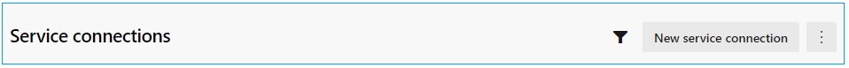
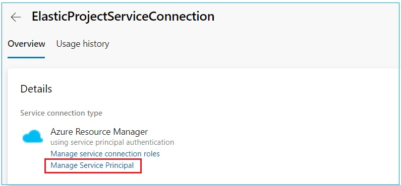
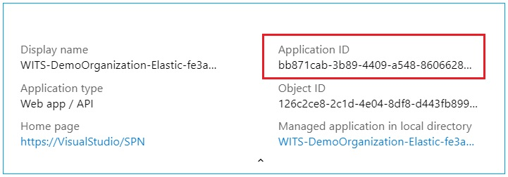
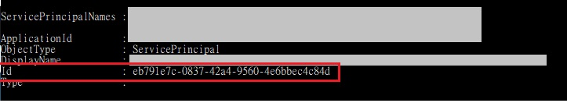

# Prerequisites
---

Below are the prerequisites steps that needs to be done to prepare for the environment prior to creating Azure YAML pipelines.

1. Create new AzDO Service connection
2. Create SendGrid account
3. Create AzDO Variable groups
4. Create AzDO Pipelines Environment

# AzDO Service connection
---

Service connection is needed for AzDO to create required resources in Azure Subscription. Please note that the following steps requires _Project Owner_ access level.
Follow below steps to create Service connection in AzDO:

1. Within your AzDO organization, navigate to the Project
2. Go to _Project Settings_ &rarr; _Service connections_ (under _Pipelines_)
3. Click _New service connection_ on the top right corner

   

4. In "_Choose a service or connection type_", choose "_Azure Resource Manager_". Click _Next_
5. In "Authentication method", choose "_Service principal (automatic)_". Click _Next_
6. Choose below information:

- Scope level: _Subscription_
- Subscription: "_{Select target subscription}_"
- Resource group: "_{Leave this empty}_"
- Service connection name: "ElasticProjectServiceConnection"
- Uncheck "_Grant access permission to all pipelines_"

  > Note: after creating the YAML pipelines, then you should add the permission for those pipelines. Please refer [here](https://docs.microsoft.com/en-us/azure/devops/pipelines/library/service-endpoints?view=azure-devops&tabs=yaml) for instructions.

7. Once the Service Connection is created, click on it &rarr; Click _Manage Service Principal_

   

8. The link will take you to Azure portal where you can retrieve the _Application ID_

   

9. In your local machine, open Powershell ISE and run below command

   `Get-AzADServicePrincipal -ApplicationId "<your_application_id>"`

   > Note: if error message shows that your Azure credentials have not been set up or have expired, you have to run _Connect-AzAccount_ and login with your credentials, the re-run the cmdlet above.

10. Copy and save the _ServicePrincipalID_

    > Note: You will need to input the _ServicePrincipalID_ into _SetupData.ps1_ for setting up the AzDO Variable groups.

    

---
[**NEXT**: &rarr; Create SendGrid account](CreateSendGridAccount.md)

[&larr; Table of Content](/Documents/DeploymentGuide/DeploymentGuide.md)