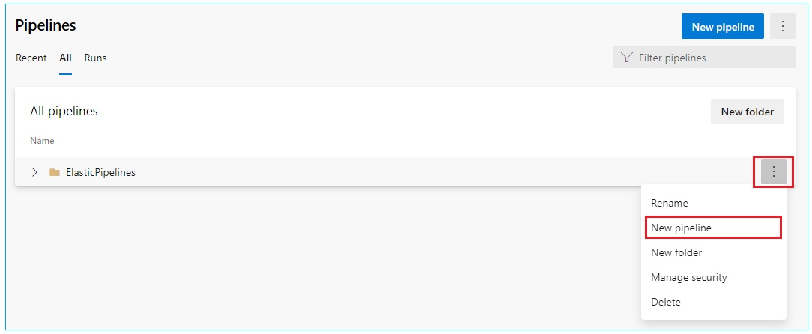
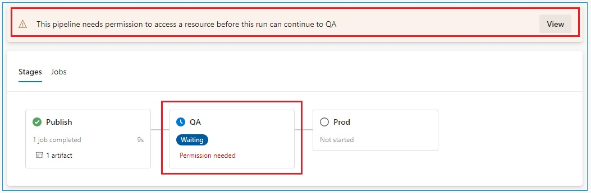
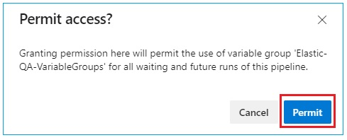

# AzDO Pipeline creation
---

This project utilizes YAML pipelines, which are separated to below pipelines

| YAML definition file          | Description                                                                                                                                           |
| :---------------------------- | :---------------------------------------------------------------------------------------------------------------------------------------------------- |
| "_AzureResourceCreation.yml_" | Setup up the Azure Resouces infrastructure needed for the solution using ARM template                                                                 |
| "_DataShipperService.yml_"    | Deploy Data Shipper Service that fetch data from AzDO to Logstash.                                                                                    |
| "_Logstash.yml_"              | Deploy Logstash configuration files to Azure Storage account and create Azure Container Instance for the Logstash.                                    |
| "_Kibana.yml_"                | Create Kibana dashboard within a specialized Kibana Space and user with read-only permission role.                                                    |

## Import YAML definition files

1. Within your AzDO Project, navigate to **Pipelines** section &rarr; **Pipelines** &rarr; click _All_ tab
2. Click _New folder_ &rarr; type "_ElasticPipelines_" as the folder name &rarr; Click _Create_
3. Hover the newly created folder above, click _More_ (the triple dots) on the most right &rarr; click _New pipelines_

   

4. Within new pipelines wizard, select "_Azure Repos Git (YAML)_"
5. Select the Elastic project repository
6. Within _Configure your pipeline_ page, select "_Existing Azure Pipelines YAML file_" &rarr; choose the _Branch_ &rarr; choose "_Pipeline/AzureResourceCreation/AzureResourceCreation.yml_" &rarr; Click _Continue_
7. Within _Review_ page, modify the "_serviceConnection_" variable value with the name of AzDO Service Connection created in Prerequisite section.
8. Click the arrow next to _Run_ &rarr; click _Save_

9. Within the pipeline page, click _More_ (the triple dots) on the top right corner &rarr; click _Rename/move_ &rarr; type "_AzureResourceCreation_" in the _Name_ field and leave the folder field as it is.
10. Repeat above steps for below YAML pipelines:
    - _DataShipperService.yml_
    - _Logstash.yml_
    - _Kibana.yml_

## Granting AzDO Service connection permission to AzDO Pipelines

Follow the instructions [here](https://docs.microsoft.com/en-us/azure/devops/pipelines/library/service-endpoints?view=azure-devops&tabs=yaml#secure-a-service-connection) to grant Service Connection permission for the Pipelines you created above.

## Running the Azure Pipelines

When running the pipelines for the first time, it needs to be run in this order:

_AzureResourceCreation_ &rarr; _Logstash_ &rarr; _DataShipperService_ &rarr; _Kibana_

When pipeline runs for the first time, permission needs to be granted for the pipeline to acccess Variable Groups for both QA and Prod. stages.
Follow below steps:

1. When job execution has reach QA stage, permission access prompt will be shown the in the pipeline summary.

   

2. Click _View_ &rarr; click _Permit_

   

3. Repeat this step for Prod. stage

---
[**PREVIOUS**: &larr; Create AzDO Pipelines Environment](CreateAzDOPipelineEnv.md)

[&larr; Table of Content](/Documents/DeploymentGuide/DeploymentGuide.md)