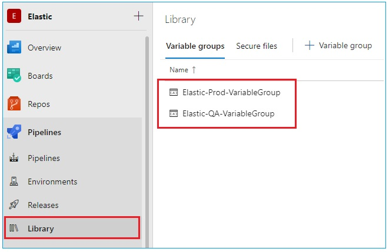

# Create AzDO Variable groups
---

AzDO Variable groups is groups of variables which will be referenced from YAML pipelines. It can be found in AzDO **Pipelines** &rarr; **Library**. Two variable groups, _Elastic-QA-VariableGroups_ and _Elastic-Prod-VariableGroups_, will be created for the YAML pipelines.
Follow below steps to create the Variable groups:

1. Create AzDO PAT token with "_Read, create, & manage_" permission to **Variable Groups** scope. Follow the guideline [here](https://docs.microsoft.com/en-us/azure/devops/organizations/accounts/use-personal-access-tokens-to-authenticate?view=azure-devops&tabs=preview-page) to create the token.
2. Navigate to the folder where you downloaded the Prerequisites scripts
3. Open _SetupData.ps1_ in your preferred text editor and supply the values as stated in the script.
4. Once you have supplied all the required values for the variables, in your Powershell ISE, navigate to the script folder and execute "_CreateVariableGroups.ps1_"

   `.\CreateVariableGroups.ps1`

5. The terminal will show the following prompts, respectively:

   - "_Please key in your organization name. E.g. Wistron_" : _supply the organization name where the YAML pipelines will be created_
   - "_Please key in your project name. E.g. ProjectELK_" : _supply the project name where the YAML pipelines will be created_
   - "_Please key in your personal access token._" : _supply the AzDO PAT created in step #1_

6. Once the AzDO Variable groups has been created, message "_Setup completed_" will be shown in the terminal. You can also check them in AzDO **Pipelines** &rarr; **Library**.

   

---
[**NEXT**: &rarr; Create AzDO Pipelines Environment](CreateAzDOPipelineEnv.md)

[**PREVIOUS**: &larr; Create SendGrid account](CreateSendGridAccount.md)

[&larr; Table of Content](/Documents/DeploymentGuide/DeploymentGuide.md)