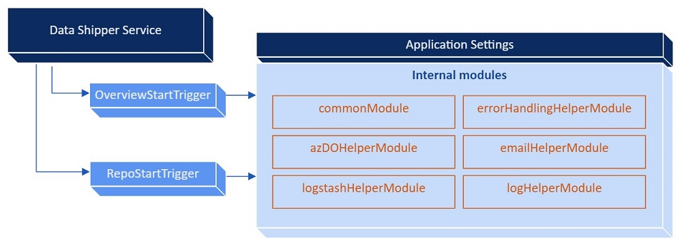
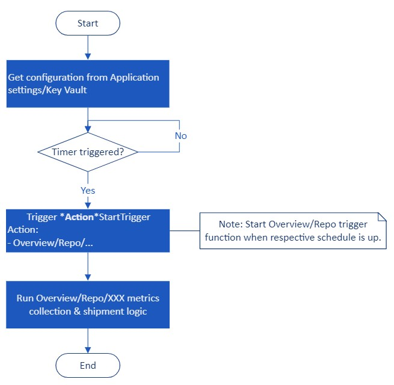
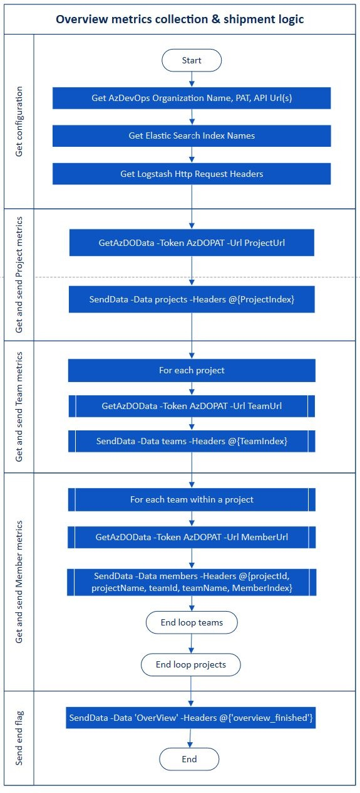
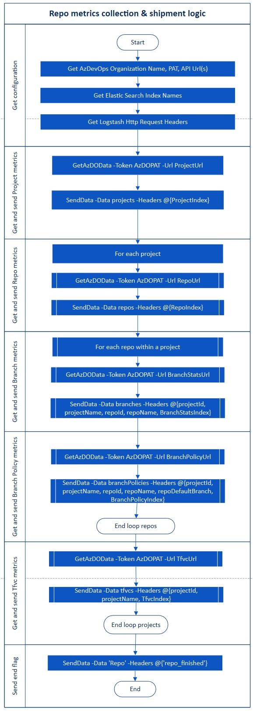

## AzDO Data Shipper Service
---

The Data Shipper Service is a lightweight cloud agent responsible to perform below tasks:
- collect AzDO metrics data
- send AzDO metrics data to Logstash

Data Shipper Service runs in Azure Function Apps, with modular components as illustrated below.

| Component | Description |
| :-------------------- | :--- |
| OverviewStartTrigger | Timer trigger-based initiator function of AzDO data collection workflow for Overview related metrics.  |
| RepoStartTrigger | Timer trigger-based initiator function of AzDO data collection workflow for Repos related metrics.  |
| commonModule | Internal common module containing commonly shared objects, such as AzDOSettings and ElasticIndexNames.   |
| azDOHelperModule | Internal helper module containing private functions to call AzDO REST API endpoints.   |
| logstashHelperModule | Internal helper module containing private function to send collected AzDO metrics to the Logstash endpoint.   |
| errorHandlingHelperModule | Internal helper module containing private function for error handling.   |
| emailHelperModule | Internal helper module containing private functions to send emails notification via SendGrid.   |
| logHelperModule | Internal helper module containg private functions to write operation logs.   |

The main workflow of Data Shipper Service is illustrated below.

Each of the _"XXXX metrics collection & shipment logic"_ workflows are shown respectively in below figures, which mainly utilizes the following functions:

| Function | Description |
| --- | --- |
| GetAzDOData | Function to call AzDO Service REST API endpoints to retrieve metrics data. This function resides within azDOHelperModule. |
| SendData | Function to send AzDO metrics data to Logstash HTTP endpoint. This function resides within logstashHelperModule. |

Data Shipper Service has two configuration settings, which are stored differently depending on its sensitiveness.

1. Azure Key Vault (for secrets data)
    - AzDO Organization name
    - AzDO Personal Access Token
    - Logstash&#39;s credentials
    - SendGrid API Key
2. Azure Function App application settings (non-sensitive data)
    - Azure Key Vault's name
    - AzDO REST API URLs
    - Max retry attempts
    - SendGrid recipient/sender names, email address and title

---
[**NEXT**: &rarr; Logstash implementation](/Documents/DesignDocument/SubFiles/LogstashImplementation.md)

[**PREVIOUS**: &larr; Elastic Stack implementation](/Documents/DesignDocument/SubFiles/ElasticStackImplementation.md)

[&larr; Table of Content](/Documents/DesignDocument/DesignDocument.md#table-of-contents)