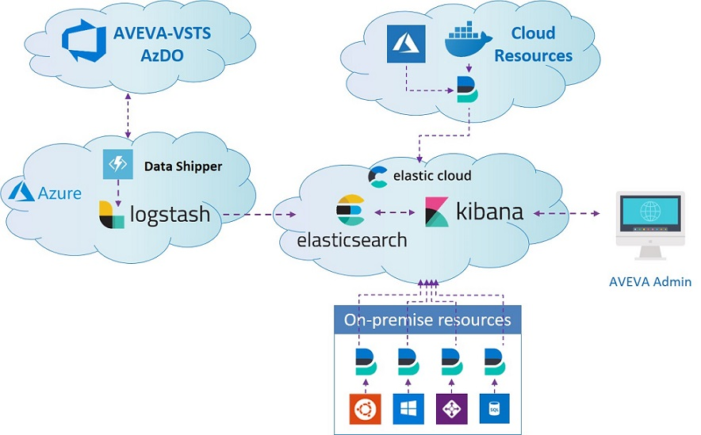
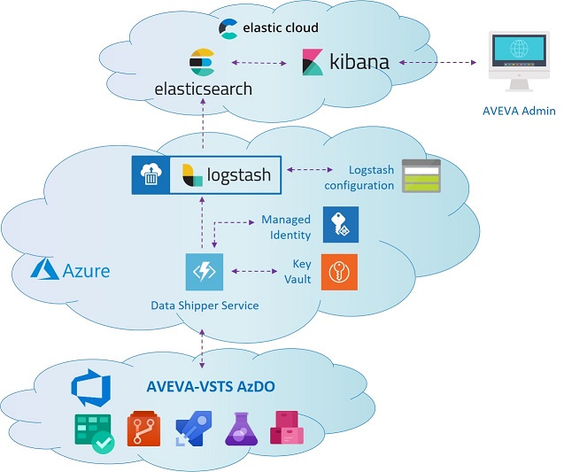

# Elastic Stack Planning
---

This section highlights details into the implementation design, without going too deep into low-level technical implementation.

Below diagram shows the overall high-level architecture of the proposed solution.

###### Figure 1 Elastic Stack Project high-level architecture

#### Data source

Metrics and logs data source can come from various sources:

- AzDO Services
- Public cloud resources logs
- On-prem infrastructure resources logs

Various Beats agent will be utilized as data shippers for above sources to Elastic Cloud platform, with the exception of AzDO Services, which will utilize a custom developed data shipper.

#### Data storage and processing

Metrics and logs data coming from various data shippers will be shipped and stored into Elasticsearch instance hosted in Elastic Cloud platform. These data are either first ingested through Logstash for parsing, filtering, and data enriching before being stored and indexed in Elasticsearch or directly be stored and indexed into Elasticsearch. Since Logstash is not yet available in Elastic Cloud, the solution shall utilize containerized Logstash instance running in Azure Cloud platform.

#### Data visualization

Metrics data that has been stored and indexed within Elasticsearch will be visualized within Kibana dashboards. The Kibana instance is hosted in Elastic Cloud platform.

The detail of each monitoring features is further described in each sub-sections.

| **Note:** Only the latest implemented features is described in the next sub-sequent sections. As the implementation progresses forward, each newly added features will be reflected in this document. |
| --- |

## AzDO Services Monitoring

This section describes the monitoring implementation for AzDO Services. AzDO Services can be broken down into below major components:

- Boards
- Repos
- Pipelines
- Test Plans
- Artifacts

The purpose for AzDO Services Monitoring is to collect metrics from above components within AzDO Organization and visualize them in a meaningful way to provide insight to AVEVA organization to measure teams&#39; performance and effectiveness over time.

Below architecture diagram shows the high-level architecture of AzDO Services Monitoring solution.

###### Figure 2 AZDO Monitoring architecture

Below table describes each entity&#39;s description.

| Entity | Description |
| --- | --- |
| AVEVA-VSTS AzDO | AzDO Services containing AVEVA Organization Projects and Teams |
| Data Shipper Service | Azure Function App for collecting AzDO Services metrics and sending them to Logstash. |
| Managed Identity | Azure Managed Identity to authenticate Function App for Key Vault access |
| Key Vault  | Azure Key Vault to store secrets data, such as AzDO Personal Access Token (PAT), AzDO Organization name, Elasticsearch endpoint, etc… |
| Logstash | Logstash instance running in Azure Container Instance (ACI), which receives metrics from Data Shipper Service, transform the metrics into usable data, and send them to Elasticsearch. |
| Logstash configuration | Azure Storage account containing Logstash custom configuration files. |
| Elasticsearch | Data storage, search and analytics engine hosted in Elastic Cloud |
| Kibana | Web-based data visualization service for metrics data hosted in Elastic Cloud |
| AVEVA Admin | AVEVA Admin user to access Kibana |

Data Shipper Service will be custom developed to utilize AzDO Services REST API for metrics collection. Data Shipper Service utilizes Personal Authentication Token (PAT) to authenticate itself with AzDO REST API. PAT is chosen due its full coverage of the AzDO REST API endpoint, while other authentication methods are not be supported for some API calls.

Sub-sequent references explains what metrics data are collected and visualized.
- [Overview Monitoring](OverviewMonitoring.md)
- [Repos Monitoring](ReposMonitoring.md)

---
[**NEXT**: &rarr;  Overview Monitoring](/Documents/DesignDocument/SubFiles/OverviewMonitoring.md)

[**PREVIOUS**: &larr; Overview](/Documents/DesignDocument/DesignDocument.md#overview)

[&larr; Table of Content](/Documents/DesignDocument/DesignDocument.md#table-of-contents)

