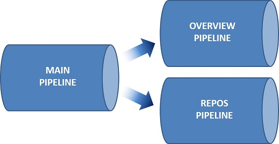
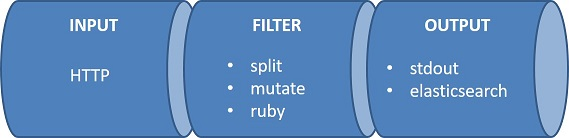

## Logstash
---

Logstash instance has multiple pipelines configurations as illustrated below.

| Pipeline | Description |
| :---------------  | :------------------------------ |
| MAIN PIPELINE     | Main pipeline to decide which sub-sequent pipeline to handle the data processing based on the metric types: projects, repos, etc...   |
| OVERVIEW PIPELINE | Pipeline to handle AzDO Overview related metrics  |
| REPOS PIPELINE    | Pipeline to handle AzDO Repos. related metrics    |

Each Logstash pipeline consists of Input &rarr; Filter &rarr; Output plugins, which can be illustrated below.

 

### Input
---
**HTTP input plugin** provides HTTP endpoint for Data Shipper Service to send its JSON payload containing AzDO metrics data. This plugin utilizes secure communication with credentials stored in Azure Key Vaults.

### Filter
---
The Data Shipper Service JSON payload contains header key &quot;metric\_type&quot; with possible values: &quot;projects&quot;, &quot;teams&quot;, &quot;members&quot;, &quot;repos&quot;, &quot;branch\_stats&quot;, &quot;branch\_policy&quot;, &quot;tfvc&quot;.

Filter plugin utilizes if-else conditioning to parse (e.g., split events, rename fields) the metrics data based on the metric type value.

**Split filter plugin** separates the value array from AzDO metrics response into individual events.

**Mutate filter plugin** renames field names and also used to re-order field hierarchy.

**Ruby filter plugin** is used to run Ruby codes, which in this case is used to extract all sub-fields within &quot;value&quot; field to individual fields and remove the &quot;value&quot; field itself.

### Output
---
**Stdout output plugin** is used to print out all events coming out from the filter pipeline. This can be used for debugging purpose.

**Elasticsearch output plugin** is used to send metrics data to Elasticsearch endpoint.

For further details to modify Logstash pipeline and its plugin configuration, please refer to _Developer Guide_.

---
[**NEXT**: &rarr;  Continuous Integration &amp; Continuous Delivery](/Documents/DesignDocument/SubFiles/AzurePipelinesImplementation.md)

[**PREVIOUS**: &larr; Data Shipper Service implementation](/Documents/DesignDocument/SubFiles/DataShipperServiceImplementation.md)

[&larr; Table of Content](/Documents/DesignDocument/DesignDocument.md#table-of-contents)